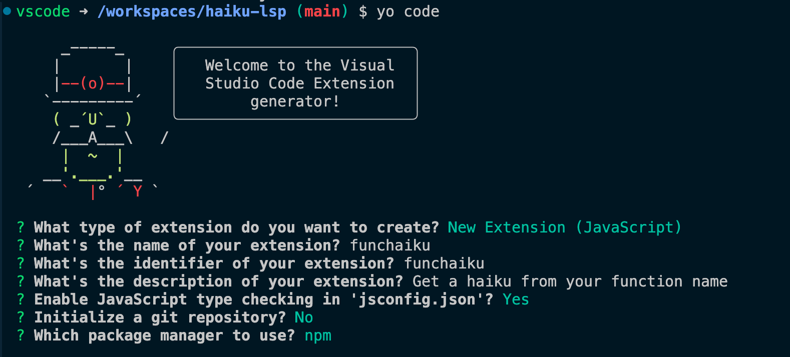

# Step-by-step tutorial

## Devcontainer
Set up the devcontainer with basic config that installs `Go` and `Node`. Set a non-root user and add some settings and extensions.

```bash
mkdir .devcontainer
touch .devcontainer/devcontainer.json
```


## Go modules
The project will use Go Modules to manage dependencies. Create and change into the `lsp-server` directory and initialise it as a module

```bash
mkdir lsp-server
cd lsp-server
go mod init github.com/monsteronfire/haiku-lsp/server
```

Add a custom `LSPServer` type with a document field.

```go
package main

import "log"

// Custom type representing the LSP server
type LSPServer struct {
	documents map[string]string
}

// Factory function to create new LSPServer instances
func NewLSPServer() *LSPServer {
	return &LSPServer{
		documents: make(map[string]string),
	}
}

func main() {
	log.Println("Haiku LSP starting...")
}


```

Side note, if you want to add module requirements and sums, run

```bash
go mod tidy
```

## Integreate with Ollama model
Since Ollama is installed on the host machine, it will need to be accessed with the following url:
```
http://host.docker.internal:11434/api/
```

This code adds `OllamaRequest` and `OllamaResponse` types to be used in the `callOllama()` function.

The shape of the Ollama request and response objects is documented in their [docs](https://ollama.readthedocs.io/en/api/#request_1).

```go
package main

import (
	"bytes"
	"encoding/json"
	"fmt"
	"log"
	"net/http"
)

const ollamaBaseURL = "http://host.docker.internal:11434/api/"
const modelName = "hf.co/bartowski/Llama-3.2-1B-Instruct-GGUF:latest"

type OllamaRequest struct {
	Model  string `json:"model"`
	Prompt string `json:"prompt"`
	Stream bool   `json:"stream"`
}

type OllamaResponse struct {
	Response string `json:"response"`
	Done     bool   `json:"done"`
}

// Custom type representing the LSP server
type LSPServer struct {
	documents map[string]string
}

// Factory function to create new LSPServer instances
func NewLSPServer() *LSPServer {
	return &LSPServer{
		documents: make(map[string]string),
	}
}

func (s *LSPServer) callOllama(prompt string) (string, error) {
	requestBody := OllamaRequest{
		Model:  modelName,
		Prompt: prompt,
		Stream: false,
	}

	jsonData, err := json.Marshal(requestBody)
	if err != nil {
		return "", err
	}

	response, err := http.Post(
		ollamaBaseURL+"generate",
		"application/json",
		bytes.NewBuffer(jsonData),
	)
	if err != nil {
		return "", err
	}

	defer response.Body.Close()

	var ollamaResp OllamaResponse
	err = json.NewDecoder(response.Body).Decode(&ollamaResp)
	if err != nil {
		return "", err
	}

	return ollamaResp.Response, nil
}

func (s *LSPServer) serve() {
	log.Println("LSP Server is now serving...")

	functionName := "handleHover"

	prompt := fmt.Sprintf("Write a creative haiku inspired by a programming function called '%s'. Do not mention, reference, or use the function name or any part of it in the haiku. Instead, capture the essence or purpose of what such a function might do in code, using poetic and programming-themed language. Only return the haiku, nothing else. If you use the function name or any part of it, your answer is incorrect.", functionName)

	haiku, err := s.callOllama(prompt)
	if err != nil {
		log.Fatalf("Error calling Ollama API: %v", err)
	}

	log.Println(haiku)
}

func main() {
	log.Println("Haiku LSP starting...")

	server := NewLSPServer()
	server.serve()
}

```

## Create basic VSCode extension
You can follow the official [VS Code instructions](https://code.visualstudio.com/api/get-started/your-first-extension) or just use the steps, below.

You will need the `yeoman` package installed, globally, so you can use it to generate a VSCode extension template. To make it available in the devcontainer, update the `postCreateCommand` to install the `yo` and `generator-code` packages 

```json
 "postCreateCommand": "go version && node --version && npm install --global yo generator-code",
```

You will need to rebuild the container for the changes to be applied.

Then run the command
```bash
yo code
```

and input the following values into the generator wizard


This will generate a new project in a folder called `funchaiku` (func haiku).

From this folder, open the `extension.js` file. Pull up the command menu with `Ctrl+Shift+P` or `Cmd+Shift+P` and select the `Debug: Start Debugging` command. Then select `VS Code Extension Development`. This will open a new window. In the new window, open up the command menu again and search for `Hello World`. In the debug console, you'll see:

```
Congratulations, your extension "funchaiku" is now active!
```

## Connecting the VS Code extension to the language server

There is only one package that needs to be installed as a project dependency to allow us to connect our VS Code extension to the language server

```bash
cd funchaiku
npm install vscode-languageclient
```

## Project structure

At this point, the project directory should look like this. There are more files, but these are the relevant ones.

```
haiku-lsp/
├── lsp-server/
│   ├── main.go
│   └── go.mod
└── funchaiku/
    ├── extension.js
    ├── package.json
    └── jsconfig.json
```